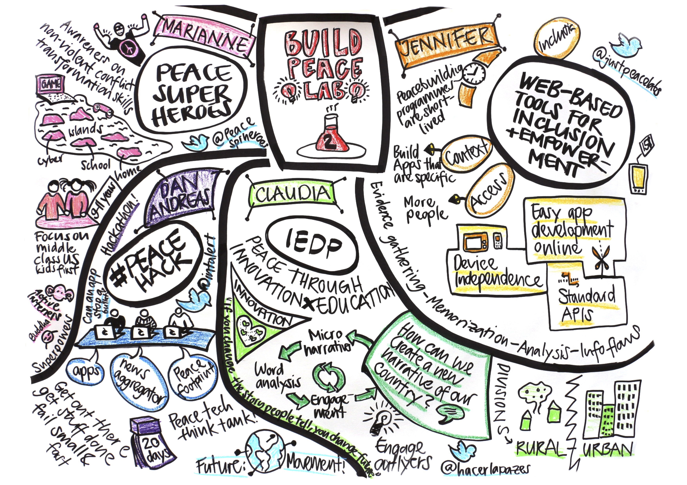

_Image: Build Peace 2015 conference. Photo by Claudia Meier_

## How to Build Peace: Be Honest
_Jacob Lefton, How To Build Up_
 
 
 
Six of us sit in a small room in Barcelona discussing how to design tech tools for peacebuilding in Burundi, Colombia, and Myanmar. This is the training for the Build Peace Fellowship, which brings new meaning to the idea of thinking global and acting local.

* Burundi with a history of intermittent violent ethnic conflict from the legacy of European colonial rule, faces its first president ignoring the constitutional term limit. Youth under 24, who have been ruled by him for close to half their life, make up 65% of the population, and Jean Marie Ndihokubwayo and Centre d’Alerte et de Prévention des Conflits (CENAP) thinks they have something to say about the future of the country. His goal is to amplify their voices in a participatory polling process.
* Colombia is working on a peace process to end decades of violent conflict, originally motivated by political disagreement and complicated by drug trade. Victims and former combatants rub shoulders in communities across the country. Diana Dajer thinks reconciliation can happen, in part, in local participatory budgeting processes required by the peace accords. 
* Myanmar faces ethno-religious conflict perpetrated by a Buddhist majority on a Muslim minority with roots reaching back 200 or more years, but the military rule that mostly kept a lid on the violence just ended. Facebook is the primary connection to the internet for most people, which has created a self-selecting echo chamber for many users, making rumors and hate-speech much easier to spread. At the Center for Diversity and National Harmony (CDNH), Maude Morrison thinks a tool that efficiently verifies or debunks rumors might be the first step to building a culture of skepticism and moderation.

Each of these projects is one piece of a much longer work to build social cohesion in places rocked by generations of violent conflict. In our hearts, we are dreamers and optimists -- we believe a peace is achievable, and we believe our tools make it possible for more voices to define that peace. It’s so easy, so tempting to think that if we simply connect everyone with an app, the world will be a better place. We are not techno-utopians, and if you thought, ‘nothing is that simple’, neither are you.

We worry: ‘If people know the end goal is for peace, will they leave?’

We ask: ‘What if government officials simply refuse to accept the results?’

We wonder: ‘Are we creating a system that can be abused by the very actors we’re hoping to reconcile?’ 

As designers and engineers focusing on what technology can do for social challenges, our task is to understand contextually and culturally, in a very critical way: How. For the past several years, our team at Build Up, and others working at the intersection of peacebuilding and technology represented in the Build Peace community have been coming to understand the processes needed to do this work well. 

Here’s an exercise. Take the tech you’re working on right now and ask yourself these questions: 
* What change am I trying to initiate, and why do I think this tool will work?
* Who is in the community that needs to own this tool for it to work, and what needs and assumptions do they bring as I build the tool with them? If I don’t know, who can I ask to get more information?
* With whom do I need to compromise, and where do I need to give up control?
* In what ways could this disrupt the community, and do I put anyone at risk? When I disrupt the community, how do I mitigate the harm and maximize the good?
* How do I know I am achieving my goals, and how do I know when I’m not?

This is the foundation of a toolkit for any socially focused technology, collaborative making or civic design process. It asks questions that drive at the heart of assumptions, ethics, participation and ownership. It is not a prescriptive formula, but a guideposts or waypoints as we stake out uncharted territories in context-sensitive design. It’s an iterative process built on a hybrid of the fundamental principles guiding work for social good and responsible design of hardware, software, and systems. 

It’s not easy, but it’s necessary. It forces us to be more honest with ourselves about what we’re making, whose input really matters in the making process, and how it might impact the world.

Image credit:
Build Peace 2015 conference. Photo: Claudia Meier
