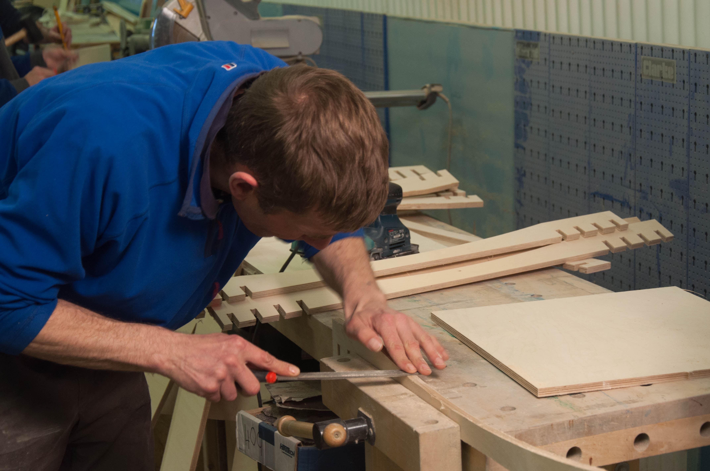
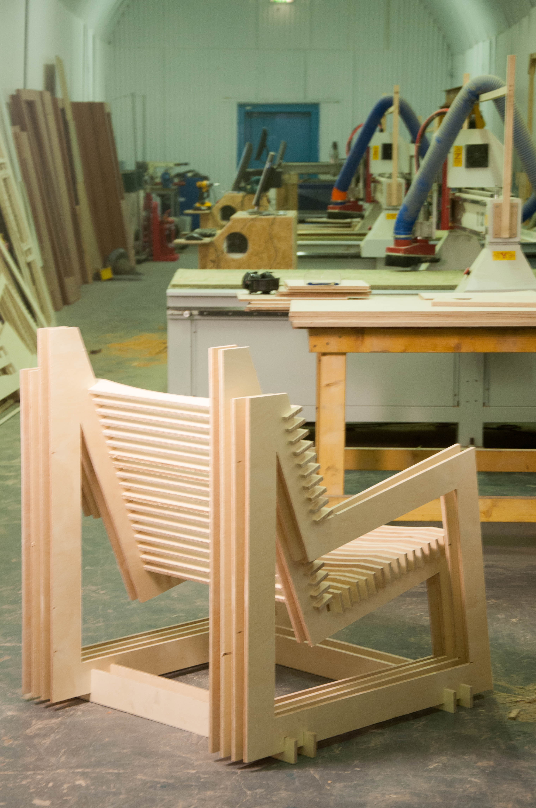

_Image1: RE:FORM project_

## RE:FORM – Reimagining Education for the Future of Redistributed Manufacturing
_Mark Gaved & Delphine Gallison_
 
 
 
Manufacturing supply chains are being reshaped and redistributed by the Internet. Designers in Delhi are working with makers in Manchester, transporting bits over networks rather than boxes by container ship. We are moving to a world where software files rather than physical products are posted, with makers local to consumers fabricating products designed and developed globally.

How do we educate future makers and designers for this new industrial reality of networked prototyping and manufacturing? The Open University (OU) and MAKLab have been exploring this challenge as part of the Royal College of Art’s _Future Makespaces in Redistributed Manufacturing_ project.

The OU is a distance learning institution.  Providing hands-on making experience for our design students is difficult as we cannot assume our students have access to any equipment or materials, yet we recognize the importance of materiality in a design education: not just understanding the theories, but also how materials and tools perform. MAKLab specialize in providing individualized training pathways in design and digital fabrication, but are interested in exploring how to scale up that individualized educational model in partnership with educational institutions.

Partnering allowed us to explore what benefits learners might gain from being involved in an online collaborative design and making process, from sketches to software models through to full scale prototypes: not only learning technical expertise but also the soft skills of negotiation, collaboration, and project management. As educators we were interested to find out how universities and makerspaces might work together to set learners a challenge that more closely resembled what they might experience in their professional lives.

To address these questions, our project was underpinned by a number of research workshops and interviews to establish the context and potential challenges to be addressed, but we were agreed that our project wouldn’t stop at the theoretical stage. We would test our ideas by running a live study with participants, aiming at real measurable outcomes.

### What did we do?

We ran a summer school: a 12 week design-make project, pairing Open University design students around the UK with maker trainees based at MAKLab Glasgow.

Each pair had to work together to design and make a flat-pack chair, CNC cut and assembled from plywood using no mechanical fixings. The OU ‘designers’ imagined initial concepts and worked these up into sketches and 2D CAD models. They then had to communicate and negotiate their ideas with their ‘maker’ partner at MAKLab, who would advise on material and equipment constraints, and help their designer-partner move their ideas to a software model suitable for cutting. The maker would then fabricate the design and offer feedback. Once each chair was made and tested, it was flat packed and shipped back to the designer for review and revisions. The pairs would reflect on the process, and how the prototype might be improved. Each pair went through this process three times. Communication was solely through a web-based workspace: we wanted to create a collaborative learning experience that could function no matter where the participants were in the world. Our engineering tutor advised us that in an industrial setting key decisions would always be committed to in writing, so this was not only a constraint that allowed us as researchers to capture all communications, but also simulated a process similar to that which our learners might experience professionally.

_Image2: RE:FORM project chair_

### What happened?

Our seven teams of designers and makers engaged with the task at hand enthusiastically. With over 750 forum posts, many design concept battles were fought, lost, and won. 18 full size prototypes were successfully completed.

As they mastered the use of the CNC router, the makers had to negotiate questions of how to communicate design issues that were incompatible with the medium, where their responsibility lay in relation to the design and how much scope they had to make adaptations to the design in order to suit the needs of the CNC router.

For the designers, the challenge was to understand the potential and limitations of the CNC router process without having experienced it first hand, communicating their concept and design choices with their maker partner and learning from their mistakes throughout the iterative process.

 _‘Words are a horrible way to express design concepts’_. Many of the participants struggled against the restrictions of communicating only via the forum and we saw our teams develop a number of innovative ways of communicating via sketches, notes, and photographs and we hope to better facilitate that in future.
 
### What we learned

Two cultures met and negotiated: formal, structured, university distance teaching at scale, and face-to-face, personalized, community based makerspace learning. We succeeded – chairs were made, collaborations happened, and participants were positive, contributing well considered reflections on how we might improve the process for the future.

The _design of the online space was critical_: rich functionalities were required to enable satisfactory interactions around ideas, sketches, and 2D and 3D models. We’re looking to further develop the shared online workspace.

_Guidance is a balance_: Were we offering an authentic professional experience, or a supported learning environment? One maker suggested if a designer sent a poor quality software file, the maker should send back exactly what was requested, even if it resulted in a blank sheet of timber. While participants were learning new skills, we had to consider at what point we should step in to offer support, and to what extent we should let them make their own mistakes. As educators, we benefitted from learning about each other’s approaches (the university and the makerspace).

_Materiality is central_:  A key aspect was finding ways to support conversations around the material aspects of the designing and making. There is immense richness to be explored around how educators can support distributed learners to explore collaborative designing and making focussed around physical artefacts: ‘sociomateriality’.

### Where next?

The success of this first project has confirmed that this is a worthwhile area of research and development which we intend to continue exploring. For future iterations, we wish to investigate the possibility of bringing on board an industry partner to set the brief and act as the client in the hope of replicating real life scenarios with industry relevance. There are also issues around scalability to be addressed: how do you keep the individualized learning experience of a makerspace environment with the number of students from a university design course? How do assure a comparable experience if you grow to a network of collaborating makerspaces and universities?

Project team: Mark Craig, Delphine Dallison, Gary Elliott-Cirigottis, Mark Gaved, Iestyn Jowers, Alan Rochead

_Project website: http://www.open.ac.uk/blogs/reform/_

RE:FORM _was funded as part of the Future Makespaces in Redistributed Manufacturing Network, a two-year project managed by the Royal College of Art and funded by the Engineering and Physical Sciences Research Council (EP/M017591/1)_.

Image credit: 
RE:FORM project chair

Note: If there is room for one photo only, please use the chair. 
