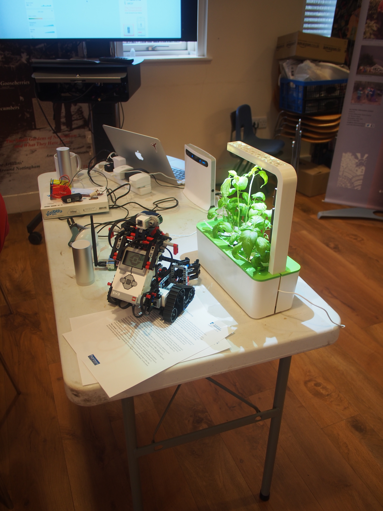

_Image: Into the Garden. Photo: Sarah Martindale_

## When the Plants Go Digital
_Dr. Ben Bedwell, Dr. Sarah Martindale, Dr. Michael Brown_
 
 
 
For most of us, technology is not a walk in the park. Although we may be increasingly glued to our screens as we move through life, this relationship can be as frustrating as it is relaxing. Devices connect us to our friends and colleagues, information, products and content; but not to our environment and the rejuvenating influence of the natural world. So the starting point for this work is the question of whether new, networked technologies can help us make the most of time we spend outdoors getting our hands dirty.

Through a series of research projects Horizon Digital Economy Research at the University of Nottingham and the School of Design at the Royal College of Arts are exploring the intersection between growing and future digital technologies. Working with a wide range of partners – from local growing groups to multi-national technology companies – we are mapping out the ways in which growing can be enhanced with technology and how technology can be enhanced with plants.

### Into the Garden

This project, funded by the EPSRC and Food Standards Agency, focused on the application of Internet of Things technologies within local growing communities. Internet of Things is often associated with domestic environments: think of smart energy meters and fridges that remind us to buy milk. But we were concentrating on sensors and gadgets that could be used outside: we explored probes that can be planted, providing a remote connection to the garden from your mobile phone; we tested automated planters that water, feed and can provide 24-hour light; and we put together a robot that can see and interact with the world around it.

Bringing these off-the-shelf technologies to a variety of growers in hands-on workshops emphasized their individual-centric nature: these products are designed to allow gardeners and allotment holders to understand their own growing conditions, but offer no capacity to learn from others who grow locally or in similar conditions. Conversely the growing communities we talked to were focused on how technology can help support the community as a whole, by building up shared knowledge about their particular area and growing preferences.

In response, we developed a set of digital probes to help urban and sub-urban growers gather, interpret and share data about their soil and plants. We combined commercially sensor and networking technology with bespoke databasing and sharing software to stitch together data and information to support community sharing of the technology, the data it collects, and most importantly the insights the data reveal. This communal approach to Internet of Things technology has proven popular with growing communities, with our technology kits currently being used on a range of community based growing projects, allowing growers to work together to attempt to debunk growing ‘myths’ and understand one another’s growing practices.

### Growing Data

The second project we have pursued in this domain flips the concept of digital growing on its head, seeing plants and growth as a means for interacting with technology that is more emotive and visceral than lines on screens and plastic peripherals. We are developing ways in which growth can be manipulated in order to communicate information and provide feedback from digital systems.

Our first application in this area is behaviour change and self-improvement, by linking success completing self-selected goals (such as steps per day or calorie targets) with the continued health of plants, we are developing a new medium for interacting with technologies. ‘Growth as data’ has a lot of interesting properties which we are exploring though this research:

- _A plant is just a plant, except when it’s not_:  the novelty of this approach means that even publicly displayed ‘data plants’ are secure repositories of even sensitive data, as only those with whom you share the purpose of the plant will be able to interpret the true meaning of how the plant grows. 
- _Tangible Ownership_: since data is stored physically in the form of the plant it is very difficult to copy, steal or reverse engineer the information stored within it. Depending on the nature of the application, plants can be used that provide rapid but short-lived growth or provide a long term embodiment of behaviour change over time.
- _Emotive Motivation_: as living, changing objects plants are inherently more engaging than cold numbers and graphs, and fundamentally less disposable. Fruiting plants and herbs can also be used to grow edible rewards for successful self-improvement.

### Digital Growing at the Digital Design Weekend

Our open, participatory workshops at the V&A give members of the public an opportunity to help us experiment with these ideas for connecting plants and technologies in new ways. Together we will build a DIY hydroponic system using open source 3D printed components and recycled household materials. And we will discuss and collectively develop new design concepts for getting the most out of this system and other combinations of technology and plants. Participants will be able to take what they need to recreate a basic hydroponic system at home. We hope they will repurpose it to suit their own circumstances and environment, and hopefully send us updates about their horticultural successes and healthy harvests.

A collaboration between the University of Nottingham: Prof. Derek McAuley, Dr. Ben Bedwell, Dr. Sarah Martindale, Dr. Michael Brown and Royal College of Arts: Prof. Sharon Baurley, Dr. Rob Phillips
