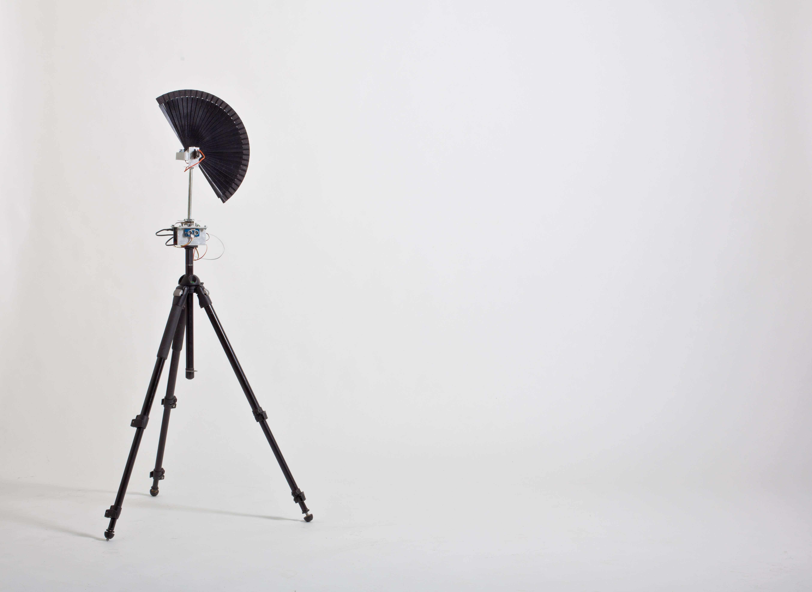

## From the Machine Room
_Jochen Zeirzer_
 
 
 
The kinetic sculptures ABANICO and COIN are part of a series of anthropomorphous machines, which have so far been shown under the summary title ‘TRIVIAL MOTION’.

The title of the series ‘TRIVIAL MOTION’ refers to the original event, so to speak, the moment of inspiration, from which the individual works originate. These are often everyday situations, in which a movement or action that at first seems incidental is shifted to the centre of attention, and for this one moment, everything else around it becomes merely a framework. This may be opening up a Spanish wooden fan (abanico), for example, where the noise generates a vacuum, in which all the other familiar impressions of a well attended summer party with loud music suddenly recede to the background, or a coin falling through a coin slot again and again, forcing the actor dying for coffee into a machine-like endless loop, from which there seems to be no escape, and in which this person suddenly begins to act like a mindless machine.

The machines themselves are developed around the central ‘finding’ of each of these situations. Similarly to some types of birds, the robot ABANICO uses the aforementioned fan as an instrument of coquetry and communication. If visitors cross the machine’s field of vision, they are recognised by sensors, and the machine unfurls a wooden fan, carrying out a classic gesture for attracting attention and favour. COIN, on the other hand, does not depend on interaction with people to function. Trapped in a monotonous endless loop, it tosses a coin into its own coin slot again and again. Again and again, the coin falls through, until the machine malfunctions.

These art machines are constructed on the principles of reverse engineering, and what they all have in common is the motif of the ambivalent relationship between human and machine. Starting from these movements and actions that initially appear banal and trivial, isolation, repetition and mechanisation result in ironic, poetic, and humorous situations, which may be perceived at first glance as meaningless or absurd; indeed the machines created by the author do not serve to produce identical products or to save time and production effort, as conventionally expected. Instead they engender projection surfaces, which enable a reflection on technology, the relationship between human and machine, and our technologized culture. 
In their pre-programmed processes, it is easy to recognise gestures that have become so automatised in our everyday life that they can no longer be distinguished from the movements of a relatively simple machine. They visualise that to the same degree humans have automatised their environment and working processes, these do the same with the humans themselves. We are subject to daily, weekly, even life-long routines, which ultimately make essential aspects of our actions appear no more interesting than the interlocking mechanical components of a machine. 

The work T2 is an homage to the mathematician Claude Elwood Shannon, a reduced interpretation of his ‘ultimate machine’. This is a machine that appears to interrupt its routine and resist the task assigned to it. In fact, however, the opposite is the case. Until its batteries are exhausted, the machine carries out precisely its specified function, which consists solely of turning itself off every time it is turned on. In light of the wholly incalculable effects that the foreseeable development of artificially intelligent machines will undoubtedly have on human society, the idea of a machine that would actually prefer not to, is highly amusing and liberating.

*Image: Abanico, Jochen Zeirzer*
