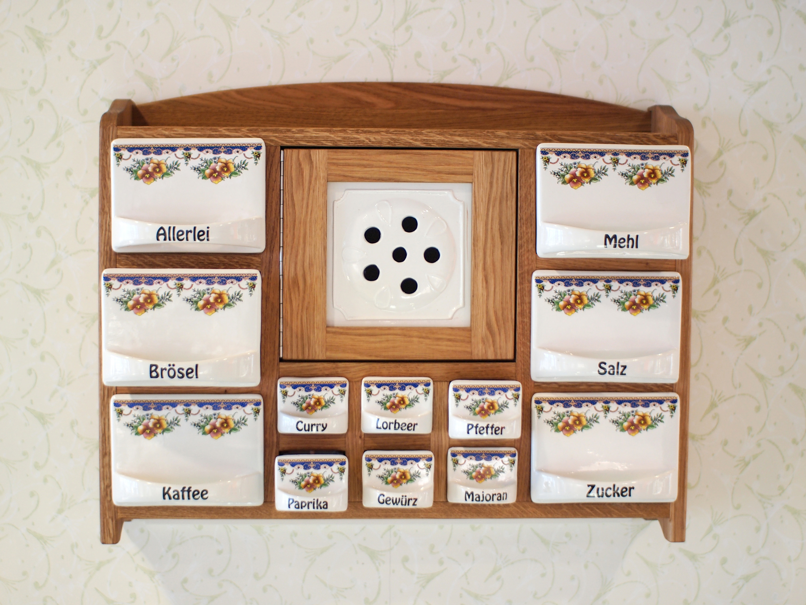

*Image: Draw:er //16, Verena Mayrhofer*

## Draw:er //16

_Verena Mayrhofer_
 					
 
 
The Alps, Mozart, Wiener Schnitzel, “The Sound of Music”— typical images that usually pop up in people's minds, thinking of Austria.
Having conversations with strangers who had never been to Austria, I was confronted by numerous stereotypes which are now collected as interviews and sorted into acoustic documents neatly arranged in a spice-rack.
					
You could fnd such spice racks in so many kitchens in Austria up to the 1960s. It was the nostalgic effect which mad me chose this kind of interface. People feel kind of save when they imagine the past wich is mostly a place where you know what to expect. A place where life is well-ordered, simple and comprehensible, far away from the challenges of the 21st Century. Parallel to complex technical gadgets, people are looking for (seemingly) traditional values, to may be able to escape the global changes. These range from fashionable traditional clothes over cottage furniture to food lables called "return to origin" offered by large grocery chains.
					
If someone from another country talks about your own nationality, do you take it personally even if you're not a patriot? Are there stereotypes you know very well or you even have never heard of? The interviews are translated and recorded to (Upper-)Austrian dialect. How does it feel when they speak in Austrian dialect? Are you nevertheless able to recognize where these people come from when they speak about Austria in Austrian dialect? And if you are not a speaker of Austrian dialect, how does it feel to know that they are talking about stereotypes and to understand little or nothing? Do some words sound familiar to certain words in your own language?
					
The participants are invited to open the drawers and listen to the prejudices in their individual order or to mix the different recordings to a babble of voices.
					
I spoke to people from Namibia, New Zealand, Japan, Canada, Chile and Hawaii, as well as to Europeans from Italy, Great Britain, Latvia and Romania. I made an effort to conduct interviews about Austria with people from a variety of regions worldwide.
In the "//16" version I added Interviews with asylum seekers who are housed in Linz at the moment. For these interviews there was a slight change in the questionnaire. I asked them what they expected before they arrived and what kind of suprises they have experienced regarding Austria and Austrians so far. The political situation has changed a lot during the last two years. In Austria, in Europe and the world. Changes that I can't ingore when it comes to a project about stereotypes and nationality, because these terms are getting bigger and bigger these days and the Austrian stereotype might have changed a bit during (the) last year(s) .
					
This project was built in 2014 as a part of my Bachelor Studies "time based and interactive media" at the Kunstuniversität Linz (University of Arts Linz).
