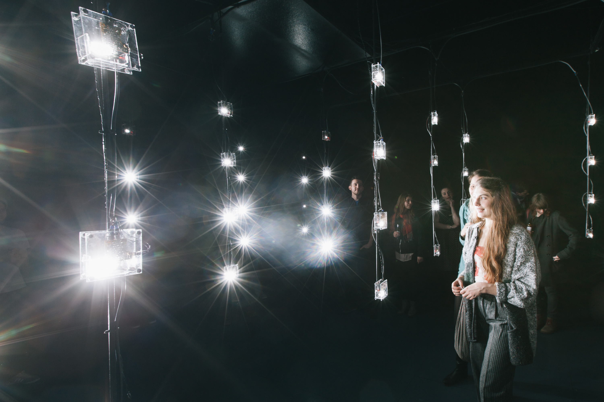

## FLASHLIGHTINSTALLATION #1 

_Dawid Liftinger_
 
 
 
Flashlightinstallation #1 is an installation which explores electronic flashes as an artistic medium. 64 modified electronic flashes form a hanging 3D matrix in a pitch-black room. Entering the room activates the flash modules. After a short delay the flashes are triggered in a random fashion, again and again. The driving rhythm of the popping of the flashes turns the room into an intense audio visual experience space. The installation is non-interactive, but the participants are invited to walk freely through the installation and are welcome to stay inside the room as long as they wish to.

The main emphasis of the work was to create an environment using electronic flashes, find out the impact it has on the participants and also isolate the possibilities and/or limitations inherent in this light source.
Foremost, Flashlightinstallation #1 is designed to stimulate the visual senses. Experiencing this space can possibly trigger color visions, can influence the sense of balance and may create a feeling of dizziness. Triggering the flashes in a random fashion adds to the confusion. This could result in the participant being overwhelmed. If experienced with another person, the flashes will create an interesting and intimate shadow-light show on the opposing person.
Sound plays a vital role in this experience. The type of flash used in this installation emits sounds. More precisely when the capacitor is loading, it creates a high pitch noise that slowly fades away. If the flash is triggered, the rapid discharge creates a zapping/cracking sound.
The electronic flashes were recycled from old disposable cameras. They have been modified so as to be controlled via Arduino and triggered via relays.

One of my main themes in my light related works, is simply to turn light on and off. Following that theme, in 2012 I found myself on my way to east Asia, precisely onto the island of Taiwan. I came to find quite a range of sound artist in Asia, working with artificial light as an integral part of their performance, or even part of the sound creating process. This can also be seen in the more and more vibrant sound art scene in Taipei. Two of the most notable artists from there are Wang Fujui 王福瑞 and Yao Chung-Han 姚仲涵.
So after getting started using regular light tubes for my artistic output and creating a performance called “Sound and Light”, I was eager to create a more unique artwork. After researching light art I quickly realised light tubes as an artistic medium are already well established, and they could be considered as an “old” medium within this branch of art. Even as early as the 1960s Dan Flavin on of the most influential minimalists, used commercially available fluorescent lights. So in search for a “new” medium, I stumbled upon the electronic flash. Unlike fluorescent tubes, the electronic flash, or even the strobe light, as a medium to create light art is much less established.
With that in mind, I started creating Flashlightinstallation #1 and plan on creating new works using the electronic flash as the main component.

Funded by Art University Linz
Thanks to Dr. Funk Gerhard, Mag.art. Smetschka Joachim, Göttfert Gregor BA for their support.

July 2014 Audiovisual Installation, 3m x 3m x 2.7m 64 x modified electronic flashes, Arduino, relays.

*Image: Flashlightinstallation #1 by Dawid Liftinger. Photo: Florian Voggeneder/AEC*
