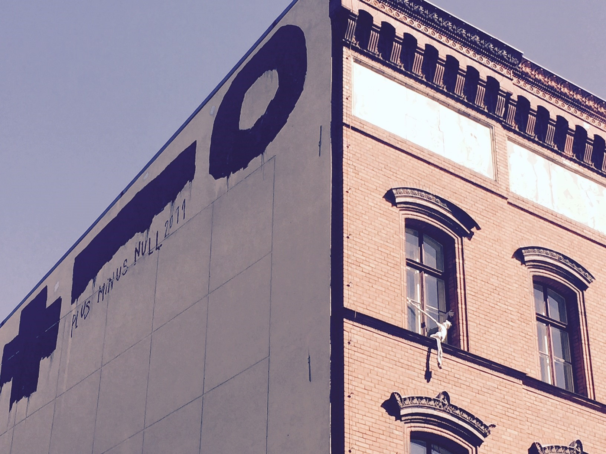

_Image: Arianna Mazzeo_

## One thing leads to another.When Design meets Engineering and other Creative Processes.Co-creating transformative learning, innovating through design.

_Arianna Mazzeo_
 
 
 
### Having the ability and the power to create, yes human beings are creative animals!
Design is everything and happens in the context of relationships, material, immaterial, not in a vacuum.
In our society still we think about design (and not only about it unfortunately), as a category or box where we close our skills and expertise. Specialisation: the separation of tasks within a system
Design is a process that use creativity and emotion, framing and re-framing our mental picture towards the actions to create an impact in the society where we live and grow.You can design education, you can design your house, you can design the community, the life you want.Our disappoint is the basis for wanting to improve the things we observe.
Design is an inclusive creative process of expression and communication,”necessary for everyone in a civilised society", it is for common good and for persons. Movements, gestures, languages of human being, beauty, elegance as form of respect, poetry. Above all, there are human needs and behaviours and the challenge for everyone to make the life better, qualitative better, meaningfully better, it is a commitment, a sense of respect for all the people’ stories, memories, behind the objects, discovering how they connect to our world and which is the new relationship with our everyday, in the streets, in the public space.

### What up when design meets engineering?
Creativity is a productive capacity where fantasy and reason are linked and its result is always a
concrete output. Engineering then use this capability of the design creative process and they learn from each other. In this dialectic and dynamic dialogue, at the centre of it all, there are persons, with their needs and expectations. Bridge the two world is a great opportunity of access and opportunity to innovate for and with community, learn how to work with others as multidisciplinary team and act for a better common ground. When participation and collaboration shared new scenario their are acting in crucial fields of our life. Instead, fantasy is a faculty of the spirit, capable to create imaginative pictures in our mind that could not be realise always in practice. With fantasy we can sleep on a chocolate numb and make everything we want; with creativity we are looking to a synthesis from datas driven from the different insights in the context we observe, to find a comprehensive outputs.

### And other creative process? Design meets art, biology, neuroscience, robotics, music, dance, theatre and performance. At the centre of innovation, still remain the creative process of design.

We’re creative animals.
Feedback are fundamentals for the common voice and intelligence of people to act for good and learn how to work with others and with the community to improve better human conditions and design the life we want. Interact with people is the major challenges of engineering and other creative process as art, dance, music, neuroscience etc., but still remain a matter of survival, to overcome stereotypes and the barrier of specialisation that neoliberalism impose to us in order to control our movements and our life.
Meaning, quality and beauty are the transversal pillars of this dynamic dialogue ( a cross-cultural understanding), in the fields of economics, design, architecture, planning, science, design research, engineering and so on, where collaborative and participatory design for a sustainable life is the major challenge to face. Creativity is the key words to make effective the opportunities to share the power of dare, have the courage to design the life we want, do our own thinking and put local needs at the center of our innovation process trough design.One thing leads to another only if we can act as change agent together and works in a common creative ground of access and opportunities for all. Let’s go!

### Further Reading:
Bauman, Z.(2003) Liquid Modernity, London, Blackwell Publishers Ltd
Bauwens, M.(2014) Network Society and Future Scenarios for a Collaborative Economy, Palgrave Macmillan, UK
Hemmels, C and Frens J, (2009)“The reflective transformative design process”, CHI 4-9 April
2009, Boston, Massachussetts, USA, ACM, p.2655-2658.
Giddens, A.(1991) Modernity and Self-Identity, London, Self and Society in the Late Modern Age. Cambridge: Polity.
Sennet, R.(2009) The Craftsman, London, Penguin Books
